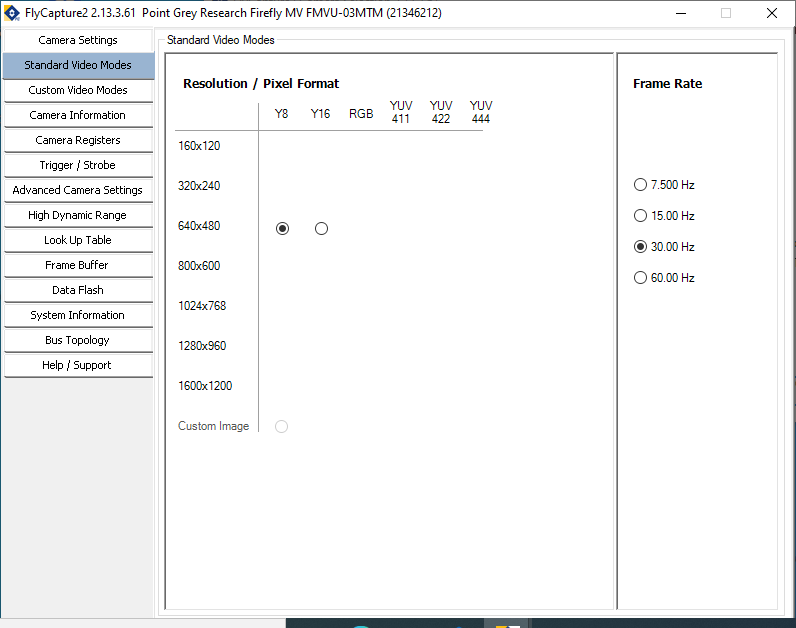
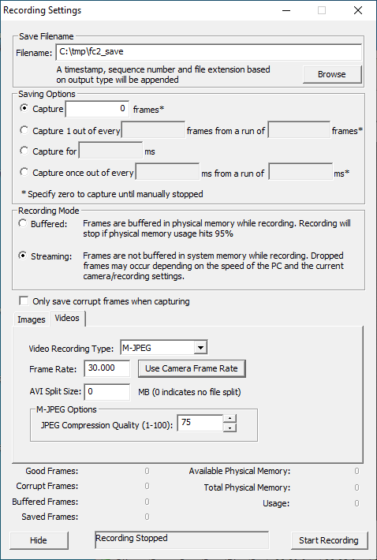

# Hardware Reference

This reference contains informations regarding the hardware or subsystem used in NoSeMaze setup and is part of NoSeMaze documentation. For instruction or help on building the setup, refer to the [setup guide](../Guides/setupGuide.md).

> :exclamation: An step file of NoSeMaze setup is provided in this folder.

Following are the subsystems with each hardware used in the setup.

## Automatic Olfactometer System

### 1. Computer

The NoSeMaze was developed using a WindowsNT operating system. The system might not be portable to older Windows OS or other OS.

### 2. National Instrument Data Acquisition Board

The board used to control the setup and acquire data is NI-USB 6216 BNC.

> :memo: __Memo__ : As the actual version, the software was developed specific to NI-USB 6216 without portability to other platform.

For more information about the NI-USB 6216 BNC, please refer to the data sheet of NI-USB 6216 BNC from National Instruments.
For more information about how the NI-USB 6216 BNC can be programmed, please refer to NIDAQmx or PyDAQmx or NI-MAX.

### 3. Olfactometer and Reward System

*__Fig. 1:__ Air Flow of Olfactometer*

*__Fig. 2:__ Wiring of Olfactometer*

*__Fig. 3:__ Wiring of Lick Sensors and Water Valves*

A set of valves (V0, V1, V2, V7, FV, WV1, WV2) which are connected via flexible tube and controlled by NI board. Each of the valves are driven by a driving board. The valves used for the olfactometer are flush valves from NResearch. The driving board used for driving the valves is also from NResearch.

*__Fig. 4:__ Air Flow of Flush Valves*

Figure 4 shows how flush valves function. The air flows through the chamber from one "flush" vent to another "flush" vent. A normally closed valve will close the third vent in the chamber if there is no signal and open it if there is a signal, letting some of the air flows through the third vent. A normally opened flush valves has a similiar build, but open the third vent instead of closing it if there is no signal and close the vent if there is a signal, instead of opening it.

For more information about the valves from NResearch and the driving board used, please contact Wolfgang Kelsch (wokelsch@uni-mainz.de).

### 4. Lick Port, Light Barrier Sensor and Lick Sensor

A box designed to deliver water. Water is delivered via a nozzle which is connected to a water container and controlled using a valve.

*__Fig. 5:__ Overview of Lick Port. __a__: odor vent leading into d. __b__: RFID antenna. __c__: light barrier sensor. __d__: box where nozzle for reward is placed into.*

Light barrier sensors used is a simple system using:

1. an infrared LED and
2. a photodiode which send TTL signal if it doesn't get enough infrared light.

The sensor is connected to the analog input 0 of the NI Board.

Lick sensors used are darlington sensors.

For more information about lick port and the sensors, please contact Wolfgang Kelsch (wokelsch@uni-mainz.de).

### 5. RFID Antenna

RFID antenna used are RFID antenna from DorsetID. For more information of which antenna is used, please contact Wolfgang Kelsch (wokelsch@uni-mainz.de).

### 6. RFID Decoder

RFID decoder user are RFID decoder from DorsetID. For more information of which decoder is used, please contact Wolfgang Kelsch (wokelsch@uni-mainz.de).

## Tube Test System

*__Fig. 6:__ Overview of Tube Test System*

### 1. RFID Antennae

Four antennae are used to detect animal activities by two tubes. Antenna used are from DorsetID. For which antenna is used, please contact Wolfgang Kelsch (wokelsch@uni-mainz.de).

### 2. RFID Decoders

Four decoders are connected using RS485 protocol in a chain. The first decoder in the chain is connected via a RS485-to-USB adapter to the computer. The first and the last decoder of the chain might need to be connected with a pull-up/pull-down resistor. For more information about the resistor, please refer to data sheet of the RFID decoder from DorsetID.

## Environment Sensor Module

Environment sensor module is provided by Fraunhofer-Institute for Manufacturing Engineering and Automation - Clinical Health Technologies in Mannheim. For more information, please contact Jan Ringkamp (jan.ringkamp@ipa.fraunhofer.de).

## Video Cameras for Analysis with Video Tracking

FLIR USB2.0 camera are used for video tracking. Video are recorded using FlyCap2Viewer from Teledyne FLIR.

*__Fig. 7__ : camera options shown after opening FlyCap2Viewer*

Following are the camera settings and the recording settings used to record the video (frame rate = 30 fps)

*__Fig. 8__: Camera Settings*

*__Fig. 9__: Standard Video Modes*

*__Fig. 10__: Custom Video Modes*

*__Fig. 11__: Recording Settings*
